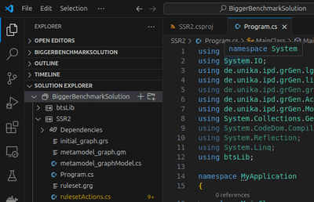

# BiGGer Benchmark 2025.1

This repository serves as the benchmark companion project to the paper:

**Dominik Grzelak and Markus Hamann**, *Improving Bigraph Rewriting with GrGen.NET to Enable Efficient System Simulation*, Formal Aspects of Computing, ACM, 2025 (accepted).

It includes the exemplary use cases discussed in the paper, providing:

- The original Bigraph model files (Ecore/XMI),
- The generated GrGen.NET artifacts (`*.gm`, `*.grs`, `*.cs`), and
- The corresponding C# model checking procedures utilizing [**libGr v7.2**](https://grgen.de/doc/API_7.2).
- The compiled [**BiGGer** tool](https://github.com/bigraph-toolkit-suite/bigraphs.grgen-bigraphs) for re-generating the GrGen.NET artifacts.

## Setup

#### Configure System

- Install **Java** on Ubuntu (e.g., openjdk 21)
- Install latest **dotnet** on Ubuntu
- Install **NET8.0**: https://learn.microsoft.com/en-us/dotnet/core/install/linux-debian?tabs=dotnet8

- Check:

```sh
$ dotnet --list-sdks
6.0.136 [/usr/lib/dotnet/sdk]
8.0.116 [/usr/lib/dotnet/sdk]
$ dotnet --list-runtimes
Microsoft.AspNetCore.App 6.0.36 [/usr/lib/dotnet/shared/Microsoft.AspNetCore.App]
Microsoft.AspNetCore.App 8.0.16 [/usr/lib/dotnet/shared/Microsoft.AspNetCore.App]
Microsoft.NETCore.App 6.0.36 [/usr/lib/dotnet/shared/Microsoft.NETCore.App]
Microsoft.NETCore.App 8.0.16 [/usr/lib/dotnet/shared/Microsoft.NETCore.App]
```

#### Configure VS Code

- Install Visual Studio Code (suggested)
- Install C# Dev Kit: https://marketplace.visualstudio.com/items?itemName=ms-dotnettools.csdevkit

## Usage

### Opening the Project Solution

Clone the repository and move into the project folder:

```sh
$ cd BiggerBenchmarkSolution
```

Open the VS Project Solution via the terminal:

```sh
$ code .
```



### Understanding the Folder Structure

```
/BiggerBenchmarkSolution/
├── CAP2/
│   ├── TestCAP.csproj
│   └── Program.cs
├── SSR3/
│   ├── TestSSR.csproj
│   └── Program.cs
├── btsLib/
│   ├── btsLib.csproj
│   └── ReactionGraph.cs
├── assets/
│   ├── cap2
│   ├── cap3
│   ├── ssr2
│   ├── ssr3
│   └── ...
└── BiggerBenchmark.sln

```

Note that the model checking procedure is defined in each project's `Program.cs`.

The project is divided into several use cases and a shared class library.

🔹 `CAP/`: Contains the Concurrent Append Problem project for n "processes".

🔹 `SSR/`: Contains the Self-Sorting Robots project for n "robots".

🔹 `btsLib/`: A shared class library that defines core data structures used by both CAP and SSR projects.

🔹 `assets/`: Contains original source files used for re-generating GrGen.NET artifacts (`*.gm`, `*.grs`, `*.cs`). Derived from Bigraph Ecore/XMI models for CAP and SSR problems (e.g., cap2, ssr3).

### Running the Benchmarks

> **Note:** If `/opt/grgen/` is not your default installation path of GrGen.NET, you have to change some settings in the `*.csproj` files.

For example, to run the benchmark for the **self-sorting robots problem** with **2 robots**:

```sh
# First build the project (from the folder /BiggerBenchmarkSolution)
$ dotnet build SSR2/SSR2.csproj
```

Then, to run the specific project:

```sh
$ dotnet run --project SSR2/SSR2.csproj
```

After completion, some files that will be exported into the folder `BiggerBenchmarkSolution/SSR2/bin/Debug/net8.0/` are:

- The individual states in `*.vcg` format
- The transition system as DOT file

### Regenerating GrGen.NET Model Files

(Optional) For reproducibility, the GrGen.NET graph and rule model files and libraries (`*.gm`, `*.grs`, `*.cs`) can be regenerated from the original Bigraph model files provided in the `assets/` directory. 
To regenerate the GrGen.NET files, you have to rerun the [**BiGGer** tool](https://github.com/bigraph-toolkit-suite/bigraphs.grgen-bigraphs) (which is shipped with this project). 
These model files have been created using [**Bigraph Framework**](https://github.com/bigraph-toolkit-suite/bigraphs.bigraph-framework). The specific code is available also within the [unit tests](https://github.com/bigraph-toolkit-suite/bigraphs.grgen-bigraphs).

The general procedure is as follows:

- First, follow the README.txt within each sample folder (e.g., `BiggerBenchmarkSolution/assets/ssr2/README.txt`)

- Then, execute (e.g., at `BiggerBenchmarkSolution/assets/ssr2/`): 

  `$ GrGen -keep ./foo/ruleset.grg`

  ```/usr/bin/mono
  The generated files will be kept in: ./foo/tmpgrgen0
  Building libraries...
   - Model assembly "./foo/lgsp-metamodel_graphModel.dll" generated.
   - Actions assembly "./foo/lgsp-rulesetActions.dll" generated.
  ```
  
  `$ cp export.grs foo/`
  
  `$ cd foo && GrShell export.grs`, then <kbd>CTRL+C</kbd> and `cd ..`

Finally, copy all required files into the specific project folder of your choice (e.g., `BiggerBenchmarkSolution/SSR2`):

- `initial_graph.grs, metamodel_graph.gm, ruleset.grg, metamodel_graphModel.cs, rulesetActions.cs`
- e.g.,: `cp foo/initial_graph.grs foo/metamodel_graph.gm foo/ruleset.grg foo/tmpgrgen0/metamodel_graphModel.cs foo/tmpgrgen0/rulesetActions.cs ../../SSR2/`

## Development

> **Note:** If `/opt/grgen/` is not your default installation path of GrGen.NET, you have to change some settings in the `*.csproj` files.

### Project Setup

```sh
# Create the library of data structures
$ dotnet new classlib -n btsLib

# Add it to the solution
$ dotnet sln add btsLib/btsLib.csproj

# Reference the library in other projects
$ dotnet add TestApp/TestApp.csproj reference btsLib/btsLib.csproj
```

### Adding a New Use Case

First, configure the Studio project files:

```sh
$ dotnet new console -n NewUseCase
$ dotnet add NewUseCase/NewUseCase.csproj reference btsLib/btsLib.csproj
$ dotnet sln add NewUseCase/NewUseCase.csproj
```

Copy the template files from the assets folder to the new use case project folder:

```sh
$ cp assets/Program.template.cs NewUseCase/Program.cs
$ cp assets/Project.template.csproj NewUseCase/NewUseCase.csproj
```

If necessary, adjust the dotnet version or GrGen.NET path in the `*.csproj`.

## References

- Paper: Dominik Grzelak and Markus Hamann, Improving Bigraph Rewriting with GrGen.NET to Enable Efficient System Simulation, Formal Aspects of Computing, ACM, 2025 (accepted).
- GitHub Repository of the BiGGer Tool: https://github.com/bigraph-toolkit-suite/bigraphs.grgen-bigraphs
  - It contains the Java code to re-generate the bigraphical models (Ecore/XMI format) in the unit tests

## License

[MIT License](LICENSE)